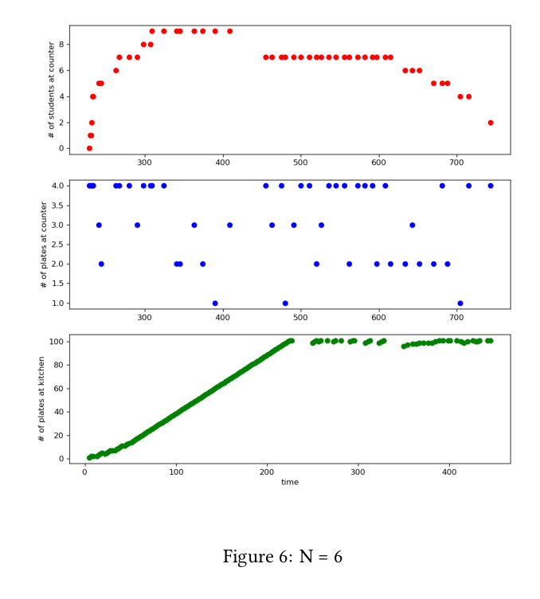
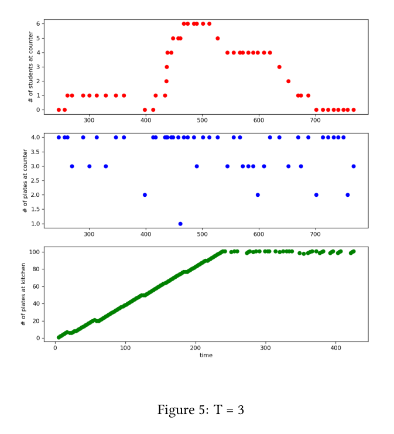

# mess-hall-simulation
Simulation of the student mess hall of a university, with the solves of multiple sync problems.

## Objective
Thereare 3 actors involved: the supplier, the cooks and the students, each of them is a separate process. There are also 3 locations involved: the kitchen, the counter and the tables.

The kitchen is the place from which the cooks take the plates of food and where the supplier delivers
them to. The tables are where every student individually eats.

There is N cooks, M students, T tables, a counter of size S, and a kitchen of size K. Every plate of
food can be of three types: soup (P), main course (C) or desert (D). A student is considered serviced
when s/he gets one of each plate from the counter. The students are very hungry. Every student after
eating goes to get more food from the counter, a total of L times.

```
Example: $./program -N 3 -M 12 -T 5 -S 4 -L 13 -F filePath
```
Constraints (all are integers)
M > N > 2
S > 3
M > T >= 1
L >= 3
K = 2LM+

## Supplier

The task of the supplier is to deliver already cooked plates of food to the kitchen. The supplier 
delivers in total exactly LxM plates of each type (P, C and D, so 3LM in total); which is equal to the
exact amount to be eaten in total by all students. If there is no room in the kitchen the supplier waits
for empty room, and once the supplier completes delivery, he’ll leave the premises. At each visit to the
kitchen the supplier delivers ONE plate. The supplier reads the file represented by the
parameter filepath, from start to finish, which must contain exactly 3LM characters, each being
either ‘P’,’C’ or ‘D’ in an arbitrary order. The character reads denote the plate to deliver to
the kitchen. The supplier terminates once it reaches the end of the file.**

The supplier process prints 3 types of messages:

```
// Entering the kitchen
The supplier is going to the kitchen to deliver soup: kitchen items
P:3,C:4,D:3=

// Afer delivery
The supplier delivered soup – after delivery: kitchen items P:4,C:4,D:3=

// Done delivering.
The supplier finished supplying – GOODBYE!
```

## Cook

Each cook gets a plate (P, C or D) from the kitchen, if there is one, otherwise the cook waits forplates to be delivered by the supplier. Then the cook places the plate on the counter if there is any room left on the counter. If there is no room, the cook waits for room to open up. Then the cook
returns to the kitchen and repeat. However, the cooks must be careful because they can cause deadlocks.
Imagine them bringing always soups and deserts to the counter. The counter fills up, but since there
are no main courses, no student is able to eat, and no cook is to place additional plates
since the counter is full. So the cooks must choose intelligently the next plate to bring, so as to avoid
this kind of a situation, we solve it in
such a way, that if the counter is full, containing exactly S items, then at least 3 of them will be distinct
(one soup, one main course and one desert), and thus at least one student will be able to take them and
eat. 

Each cook process prints 4 types of messages:

```
// waiting for/getting deliveries
Cook 0 is going to the kitchen to wait for/get a plate - kitchen items
P:4,C:4,D:3=

// Going to the counter
Cook 0 is going to the counter to deliver soup – counter items P:2,C:1,D:1=

// After delivery to counter
Cook 1 placed desert on the counter - counter items P:2,C:1,D:2=

// After finishing placing all plates
Cook 0 finished serving - items at kitchen: 0 – going home – GOODBYE!!!
```

## Student

The students wait in front of the counter. There is no queue or line of any form at the counter. Any
student might be serviced at any time. A student waits until at least one soup, one main course and
one desert are available on the counter, in which case she/he takes all 3 of them at once and leave
the counter.

e.g. what if one soup is available, should the student take it? NO! The student waits until all three
are available to take. She/he either takes all three plates together (P, C and D) or none.

Then the student finds an empty table, sits down and eats, if there are no empty tables, the student
waits for one. After eating, the student will once again go to the counter and repeat this behavior L
times.

Each student process prints 5 types of messages:

```
(round x) where 1 <= x <= L

// arriving at the counter/waiting for food
Student 1 is going to the counter (round 1) - # of students at counter: 1 and
counter items P:2,C:1,D:2=

// waiting for/getting a table
Student 0 got food and is going to get a table (round 1) - # of empty tables: 4

// sitting to eat
Student 0 sat at table 1 to eat (round 4 ) - empty tables:


// done eating, going again to the counter; times x, where x is increased to x+
Student 0 left table 1 to eat again (round 2 ) - empty tables:

// after finishing eating L times
Student 2 is done eating L=5 times - going home – GOODBYE!!!
```

## Implementation
Every actor implemented as a separate process. So we have in total at least N+M+1 processes. The
objective is to simulate this mess hall and print on screen what every actor is doing from the very start
when the supplier arrives, until the last student finishes eating L times. Our main process is create
and prepare all the necessary tools (semaphores, shared memory, etc) and then fork all actors involved
and finally wait for them to finish.


## Undergraduates or Graduates

Additionaly, it can be assumed that the students are either undergraduates (U) or graduates (G), with a simple swith:

M=U+G > 3, U>G>=1

```
Example: $./program -N 3 -T 5 -S 4 -L 13 -U 8 -G 2 -F filePath
```
And that graduate students have priority at the counter over undergraduates. As long as there are
graduates in front of the counter waiting for their food, no undergraduate is allowed to be serviced.

## Stats
We study the effect of each input parameter (M, N, S, T, L) on your program’s output. Tried various values
for each parameter while keeping the rest of them fixed and for each of those combinations we prepared a
plot containing the # of students waiting at the counter, the # of plates at the counter and the # of plates
at the kitchen across time.

You can find the graphs for multiple combinations in the report. Here are some graph examples from the report:

<p align="center">
  
</p>

<p align="center">
  
</p>

